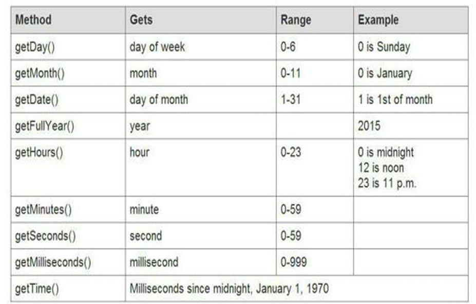
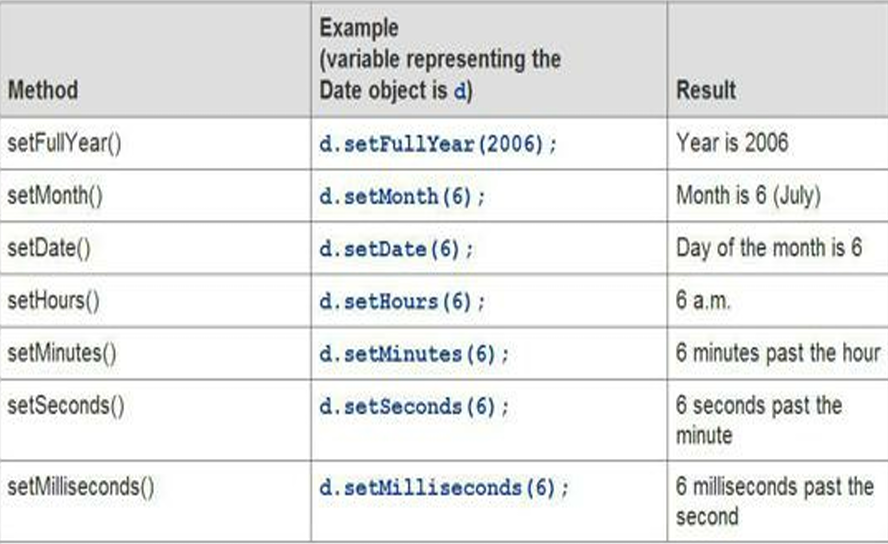
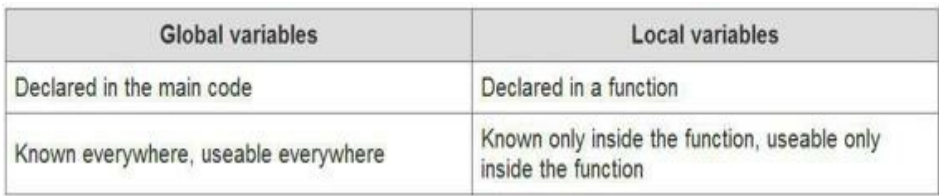

# Learn Complete Javascript

## Table of Contents

[Learn Complete Javascript](#learn-complete-javascript)

1.  [Basics](#basics)

    1.1. [Chapter 1 - Alert](#chapter-1---alert)

    1. [Chapter 2 - Variables for String](#chapter-2---variables-for-string)

    1.3 [Chapter 3 - Variable for Numbers](#chapter-3---variable-for-numbers)

    1.4 [Chapter 4 - Variable Names Legal and Illegal](#chapter-4---variable-names-legal-and-illegal)

    1.5 [Chapter 5 & 6 - Math expressions: Familiar and Unfamiliar Operators](#chapter-5--6--math-expressions-familar-and-unfamilar-operators)

    1.6 [PostFix And PreFix Operators](#postfix-and-prefix-operators)

    1.7 [Chapter 7 - Math expressions: Eliminating ambiguity](#chapter-7---math-expressions-eliminating-ambiguity)

    1.8 [Chapter 8 - Concatenating text String](#chapter-8---concatenating-text-string)

    1.9 [Chapter 9 - Prompts](#chapter-9---prompts)

    1.10 [Chapter 10 - If Statements](#chapter-10---if-statements)

    1.11 [Chapter 11 - Comparision Operators](#chapter-11---comparision-operators)

    1.12 [Chapter 12 - if...else and else if statements](#chapter-12---ifelse-and-else-if-statements)

    1.13 [Chapter 13 - Testing set of Conditions](#chapter-13---testing-set-of-conditions)

    1.14 [Chapter 14 - if statements nested](#chapter-14---if-statements-nested)

    1.15 [Chapter 15 - Arrays](#chapter-14---Arrays)

    1.16 [Chapter 16 - Arrays: Adding and removing elements](#chapter-16---arrays-adding-and-removing-elements)

    1.17 [Chapter 17 - Arrays: Removing, inserting, and extracting elements](#chapter-17---arrays-removing-inserting-and-extracting-elements)

    1.18 [Chapter 18 - Loops](#chapter-18---for-loops)

    1.19 [Chapter 19 - for loops: Flags, Booleans, array length, and loopus interruptus](#chapter-19---for-loops-flags-booleans-array-length-and-loopus-interruptus)

    1.20 [Chapter 20 - Nested Loops](#chapter-20---nested-loops)

    1.21 [Chapter 21 - String: Changing Case](#chapter-21---string-changing-case)

    1.22 [Chapter 22 - Strings measuring length and Extracting parts](#chapter-22---strings-measuring-length-and-extracting-parts)

    1.23 [Chapter 23 - Finding Segments](#chapter-23---finding-segments)

    1.24 [Chapter 24 - Finding a Character at a Location](#chapter-24---strings-finding-a-character-at-a-location)

    1.25 [Chapter 25 - String: Replacing Characters](#chapter-25---strings-replacing-characters)

    1.26 [Chapter 26 - Rounding Numbers](#chapter-26---rounding-numbers)

    1.27 [Chapter 27 - Generating Random Numbers](#chapter-27---generating-random-numbers)

    1.28 [Chapter 28 - Convetring String to Integer and Decimals ](#chapter-28---converting-strings-to-integers-and-decimals)

    1.29 [Chapter 29 - Converting String to Number and number to String](#chapter-29---converting-strings-to-numbers-numbers-to-strings)

    1.30 [Chapter 30 - Controlling the length of Decimals](#chapter-30---controlling-the-length-of-decimals)

    1.31 [Chapter 31 - Getting Current Date and Time.](#chapter-31---getting-current-date-and-time)

    1.32 [Chapter 32 - Extracting Part of the Date and Time.](#chapter-32---extracting-part-of-the-date-and-time)

    1.33 [Chapter 33 - Specifing a Date and Time.](#chapter-33---specifying-a-date-and-time)

    1.34 [Chapter 34 - Changing Elements of a Date and Time.](#chapter-34---changing-elements-of-a-date-and-time)

    1.35 [Chapter 35 - Functions](#chapter-35---function)

2.  [Intermediate](#intermediate)

3.  [Advance](#advance)

## Basics

### Chapter 1 - Alert

`alert()` is a function is used to show popup message to the user.

alert is a **keyword** in js.
**keyword** is a word that has special meaning for Javascript.

**\*Note** that alert isn't capitalized. If you capitalize it, the script will stop.

```Javacript Code
alert("Hello World from JS")
```

### Chapter 2 - Variables for String

**Variable**:Varaible refers to a container which we used to store some values.

**String**: String is collection of charaters enclosed with Quotation marks.Eg:"Hello World","Bilal","What you are doing" ...

**Syntax for Variables**

`var variable_name = value;`

**Define**

**`var`** is also a keyword that define we need a container to store value.

**`variable_name`** this is refernce name to call the actual value and we used this to remember value.

**`=`** this is called an assignment operator to store actual value in the container (memory).

```Javascript Code
var myName = "Bilal";
var myNationality = "Pakistan";

// used this value
alert(myName);
alert(myNationality);
```

### Chapter 3 - Variable for Numbers

**Number** is a numeric value used to perform arithmethic operations.

**\*Note** If you enclose a number in quotation marks, it's a string. JavaScript can't do addition on it. It can do addition only on numbers not enclosed in quotes.

```Javascript Code
var age = 18;
var weight  = 200;

alert(age);
alert(weight + 120)

```

### Chapter 4 - Variable Names Legal and Illegal

Naming Convention For Varibale

- A variable name can't contain any spaces.
- A variable name can contain only letters, numbers, dollar signs($), and underscores(\_).
- Though a variable name can't be any of JavaScript's keywords.
- Capital letters are fine, but be careful. Variable names are case sensitive. A rose is not a
  Rose.

---

| Legal Variable Names | Illegal Variable Names |
| -------------------- | ---------------------- |
| `age`                | `2ndName`              |
| `user_score`         | `my variable`          |
| `_totalAmount`       | `special-character`    |
| `first_name`         | `123abc`               |
| `MAX_SIZE`           | `illegal-name!`        |

---

### Chapter 5 & 6- Math expressions: Familar and Unfamilar Operators.

Here's a table listing some common arithmetic operators in JavaScript:

| Operator | Description         | Example                 |
| -------- | ------------------- | ----------------------- |
| `+`      | Addition            | `result = num1 + num2;` |
| `-`      | Subtraction         | `result = num1 - num2;` |
| `*`      | Multiplication      | `result = num1 * num2;` |
| `/`      | Division            | `result = num1 / num2;` |
| `%`      | Modulus (Remainder) | `result = num1 % num2;` |
| `++`     | Increment           | `num++;`                |
| `--`     | Decrement           | `num--;`                |

**Explanation**:

1. **Addition (`+`):** Adds two values together.
2. **Subtraction (`-`):** Subtracts the right operand from the left operand.
3. **Multiplication (`*`):** Multiplies two values.
4. **Division (`/`):** Divides the left operand by the right operand.
5. **Modulus (`%`):** Returns the remainder of the division of the left operand by the right operand.
6. **Increment (`++`):** Increases the value of the operand by 1.
7. **Decrement (`--`):** Decreases the value of the operand by 1.

Example Usage:

```javascript
let num1 = 10;
let num2 = 5;
let result;

result = num1 + num2; // result = 15
result = num1 - num2; // result = 5
result = num1 * num2; // result = 50
result = num1 / num2; // result = 2
result = num1 % num2; // result = 0 (remainder of 10 / 5)
num1++; // num1 is now 11
num2--; // num2 is now 4
```

These operators are fundamental for performing arithmetic operations in JavaScript.

### PostFix And PreFix Operators

In JavaScript, postfix and prefix operators are used for incrementing or decrementing the value of a variable. These operators are `++` (increment) and `--` (decrement).

1. **Postfix Increment (`++`):**

   - Adds 1 to the current value of the variable.
   - Returns the original value of the variable.
   - The syntax is `variable++` or `++variable`.

   Example:

   ```javascript
   let num = 5;
   let result = num++;
   console.log(result); // Output: 5
   console.log(num); // Output: 6
   ```

2. **Postfix Decrement (`--`):**

   - Subtracts 1 from the current value of the variable.
   - Returns the original value of the variable.
   - The syntax is `variable--` or `--variable`.

   Example:

   ```javascript
   let num = 8;
   let result = num--;
   console.log(result); // Output: 8
   console.log(num); // Output: 7
   ```

3. **Prefix Increment (`++`):**

   - Adds 1 to the current value of the variable.
   - Returns the updated value of the variable.
   - The syntax is `++variable`.

   Example:

   ```javascript
   let num = 3;
   let result = ++num;
   console.log(result); // Output: 4
   console.log(num); // Output: 4
   ```

4. **Prefix Decrement (`--`):**

   - Subtracts 1 from the current value of the variable.
   - Returns the updated value of the variable.
   - The syntax is `--variable`.

   Example:

   ```javascript
   let num = 9;
   let result = --num;
   console.log(result); // Output: 8
   console.log(num); // Output: 8
   ```

It's important to understand the difference between postfix and prefix forms, especially when the operators are used within more complex expressions. The value returned by the postfix form is the original value, while the value returned by the prefix form is the updated value after the increment or decrement operation.

### Chapter 7 - Math expressions: Eliminating ambiguity

Ambiguity means BODMAS, in JS operators has precedence to perform math expression. The High precedence operator is perform first. but in BODMAS we used paranthesis to restrict the expression.

```Javascript
var total_cost = 12 + 5 * 8;
console.log(total_cost); // 52


// using BODMAS
var totalCost = (12 + 5) * 8;
console.log(totalCost); // 136

```

You see the difference of the above two expression.

### Chapter 8 - Concatenating text String

Concatenation is used to merge two or more than two string to create a descriptive message.

Using the plus operator to cancatenate the two Strings

```Javascript
var name = "Bilal";
var message = "Thanks " + name;
alert(message); // Thanks Bilal
```

If you put numbers in quotes, JavaScript concatenates them as strings rather than adding them. This code...

```Javascript
alert("2" + "2"); // 22
```

If we try to add numbers with string it will cancatenate as a String and combine them:

```javascript
alert("2 plus 2 = " + 2 + 2); // 2 plus 2 = 22

alert(2 + "age"); // 2age
```

we can also used `.concat()` metghods to combine two strings.

```Javascript
var first_name = "Muhammad ";
var last_name = "Bilal";

var full_name = first_name.concat(last_name);
console.log(full_name);
```

### Chapter 9 - Prompts

`prompt()` is just like alert but the differnce is that `alert()` is used to show message and `prompt()` is used to ask question and gather information from the user.
`prompt()` is also a window method in javascript and javascript keyword.
prompt always a return a value in string enter by the user.

```javascript
var username = prompt("Enter Your Name");
alert("Thanks " + username);
```

### Chapter 10 - If Statements

`if statement` is used to maintain conditional logics in our programs. let us suppose we create a program for print the salary of the employee.

- If the employee's salary is above 5000 add a bonus of 2000
- If the employee's salary is above 10,000 add a bonus of 5000.
- If the employee's salary is less than 5000 not need to add bonus.

```javascript
var salary = 5000;
if (salary > 5000) {
  salary = salary + 2000;
}
if (salary > 10000) {
  salary = salary + 5000;
}
alert(salary);
```

### Chapter 11 - Comparision Operators

In JavaScript, comparison operators are used to compare values and return a Boolean result (either true or false). Here are the common comparison operators in JavaScript:

| Operator | Description                     | Example   |
| -------- | ------------------------------- | --------- |
| `==`     | Equality (with type coercion)   | `a == b`  |
| `!=`     | Inequality (with type coercion) | `a != b`  |
| `===`    | Strict Equality (no coercion)   | `a === b` |
| `!==`    | Strict Inequality (no coercion) | `a !== b` |
| `>`      | Greater Than                    | `x > y`   |
| `<`      | Less Than                       | `x < y`   |
| `>=`     | Greater Than or Equal To        | `x >= y`  |
| `<=`     | Less Than or Equal To           | `x <= y`  |

**Explanation**:

1. **Equality (`==`):** Checks if two values are equal (with type coercion).
2. **Inequality (`!=`):** Checks if two values are not equal (with type coercion).
3. **Strict Equality (`===`):** Checks if two values are equal without type coercion.
4. **Strict Inequality (`!==`):** Checks if two values are not equal without type coercion.
5. **Greater Than (`>`):** Checks if the value on the left is greater than the value on the right.
6. **Less Than (`<`):** Checks if the value on the left is less than the value on the right.
7. **Greater Than or Equal To (`>=`):** Checks if the value on the left is greater than or equal to the value on the right.
8. **Less Than or Equal To (`<=`):** Checks if the value on the left is less than or equal to the value on the right.

```javascript
let a = 5;
let b = "5";
console.log(a == b); // Output: true (after type coercion)

let a = 5;
let b = "5";
console.log(a != b); // Output: false (after type coercion)

let a = 5;
let b = "5";
console.log(a === b); // Output: false (no type coercion)

let a = 5;
let b = "5";
console.log(a !== b); // Output: true (no type coercion)

let x = 10;
let y = 5;
console.log(x > y); // Output: true

let x = 3;
let y = 8;
console.log(x < y); // Output: true

let x = 5;
let y = 5;
console.log(x >= y); // Output: true

let x = 3;
let y = 3;
console.log(x <= y); // Output: true
```

These operators are fundamental for making decisions and controlling the flow of a program based on the comparison of values.

### Chapter 12 - if...else and else if statements

In the previous chapter, we will learn `if statements` that any condition we used to create a new if statement.
But the problem is that for any case where its true or false our programs execute this lines and that's make our program slow. so here is `if...else statements` comes. when we want to do something when the condition is true and also do something if the condition goes to false.

let's take a scenerio:

- if the percentage of the students is greater than 70, show an alert box to say congrats.
- and if the percentage is is less than equal to 70, show the popup to say "Need work Hard!".

by using only `if statements`

```javascript code
// add plus operator before prompt method to convert string into Number
var percentage = +prompt("Enter Percentage");
if (percentage > 70) {
  alert("Congratulations");
}

if (percentage <= 70) {
  alert("need hard word");
}
```

we does not need to check the second condition if the first condtion is false.
by using `if...else statements`

```javascript
var percentage = +prompt("Enter Percentage");
if (percentage > 70) {
  alert("Congratulations");
} else {
  alert("need hard word");
}
```

but what if we have multiple condition like create a complete grading system.

- percentage >= 80 => print A+
- percentage >= 70 => print A
- percentage >= 60 => print B
- percentage >= 50 => print C
- percentage >= 40 => print F

here comes `if...else if...else statements`

```javascript
var percentage = +prompt("Enter Percentage");

if (percentage >= 80) {
  alert("A+");
} else if (percentage >= 70) {
  alert("A");
} else if (percentage >= 60) {
  alert("B");
} else if (percentage >= 50) {
  alert("C");
} else {
  alert("F");
}
```

### chapter 13 - Testing set of Conditions

Certainly! Here's a table summarizing the logical operators in JavaScript along with an example scenario:

| Operator | Name        | Example    | Description                               |
| -------- | ----------- | ---------- | ----------------------------------------- |
| `&&`     | Logical AND | `a && b`   | return `true` if a and b both are true.   |
| `\|\|`   | Logical OR  | `a \|\| b` | return `true` if any one of them are true |
| `!`      | Logical NOT | `!a`       | reverse the condition                     |

Now, let's create a scenario to understand these operators:

**Scenario: Admission Eligibility**

Imagine a school admission is open, the criteria of the admission is that if test score is greater than equal to 50 and last class score is greater than 60, then the admission is confirmed.

```javascript
var testScore = +prompt("Enter test score");
var lastClass = +prompt("Enter last class score");

// Logical AND: Both criteria must be met for admission
if (testScore >= 50 && classScore > 60) {
  alert("admission confirmed");
} else {
  alert("sorry");
}
```

This scenario demonstrates how logical operators can be used to make decisions based on multiple conditions in a program.

### Chapter 14 - if statements nested

we can used if statement inside the if statements

```javascript
var food = "biryani";
var expanse = 50;
if (food === "biryani") {
  if (expanse > 40) {
    alert("take a bottle of pakola");
  } else {
    alert("only take food");
  }
}
```

### Chapter 15 - Arrays

Now we learned how we can store single values in variable. but what if we want to store multiple values in the variable. Here the importance of arrays come.

`array` is used to store similar data in the single values.
we can get the value of array using its indexes and indexes start from 0.

```javascript
var city = ["Karachi", "Lahore", "Queta", "Islamabad"];
console.log(city[0]); // Karachi
console.log(city[1]); // Lahore
console.log(city[2]); // Queta
console.log(city[3]); // Islamabad
```

### Chapter 16 - Arrays: Adding and removing elements

Adding or removing elements from an array is an essential task in Programing. when we have to declare an empty array and add or remove items from it.

```javascript
var pets = [];

// assign value
pets[0] = "cat";
pets[1] = "dog";
pets[2] = "chicken";

// If we get the value of pet[4] its will return undefined, that means the value of pets[4] is not assign
```

If we get the value of `pet[4]` its will return undefined, that means the value of `pets[4]` is not assign

**Remove elements at end of the array `pop()`**
`pop()` method is used to remove elements from the end of the array.

```javascript
var pets = ["Dog", "Cat", "Birds", "Snake"];
pets.pop(); // it will remove the snake from the pets array.
```

**\*Note** the value `pop()` method remove it will return the same elements.

**Adding new value at end of array `push()`**

```javascript
var pets = ["Dog", "Cat", "Birds", "Snake"];
pets.push("lizards"); // it will add the lizards from the pets array.
```

### Chapter 17 - Arrays: Removing, inserting, and extracting elements

`shift()` method used to remove elements from the beginging of the array.

`unshift()` method used to add elements from the begining of the array.

```javascript
var cities = ["Karachi", "Lahore", "Queta"];

cities.unshift("Islamabad"); // add Islamabad to the beging of the array.

console.log(cities); // ['Islamabad', 'Karachi', 'Lahore', 'Queta']

cities.shift(); // remove the first element of the array.
```

**\*Note**

1. `push()` and `unshift()` method return the length of the array.
2. `pop()` and `shift()` method return the removing element of the array.

`splice()` method is used to add or remove multiple value anywhere in an array.

```javascript
var cities = ["Lahore", "Karachi", "Islamabad"];

// to add elements at index 1 without deleting any value
cities.splice(0, 0, "Hyderabad", "Multan");
// ['Hyderabad', 'Multan', 'Lahore', 'Karachi', 'Islamabad']

// to remove Multan from it
cities.splice(1, 1); // this will return the removing elements
// ['Hyderabad', 'Lahore', 'Karachi', 'Islamabad']

// to remove some value and add some values
cities.splice(1, 2, "Peshawar", "Muree", "Sawat");
// ['Hyderabad',"Peshawar","Muree","Sawat",'Islamabad']
```

`slice()` method to copy one or more consecutive elements in any position.

### Chapter 18 - For loops

`loops` is used to do something sequentially means you have to print count from 1 to 100
what you do?

you have to write `console.log(1)` 100 times.

and the second thing is we run a loop to print count from 1 to 100

```javascript
for (var count = 1; count <= 100; count++) {
  console.log(count);
}
```

In Javascript, there are 3 things which are common in every loop.

1. `initialization` which means what is the initial value.
2. `condition` which means where to stop the loop.
3. `increament` how to update the value.

There are 3 types of loop in javascript:

1. For loop.
2. While Loop.
3. Do while loop.

**For Loop** is used where we know the range of the loop.
also called range loop.

```javascript
for (var i = 0; i <= 100; i++) {
  console.log(i);
}
```

**While Loop** is used when we want to do something on the basis of user input.

```javascript
var count = 1; // initialization

while (count <= 100) {
  //condition
  console.log(count);
  count++; // updation
}
```

**Do While Loop** is used when we want the loop is execute atleast one time, if the condition is wrong.

```javascript
var count = 10; // initialization
do {
  console.log(count);
  count++; // updation
} while (count < 10); // conditions
```

### Chapter 19 - for loops: Flags, Booleans, array length, and loopus interruptus

`flag` is just a variable which is defined by developer used to indicate the status of the programs.
lets take a example:

```javascript
var matchFound = "no"; // flags to indicate the status

var cleanestCities = ["Karachi", "Lahore", "Islamabad", "Quetta"]; // List of cleanest city
var userCity = prompt("Enter Your City: "); // usercity

for (var i = 0; i < cleanestCities.length; i++) {
  if (userCity === cleanestCitiess[i]) {
    matchFound = "yes";
  }
}

if (matchFound === "yes") {
  alert(userCity + "is in the Cleanest City");
} else {
  alert(userCity + "is not in the Cleanest City");
}
```

`break` is used to stop the loop and break the execution of the loop.
`continue` is used to skip one execution of the program.

```javascript
// if we found a user city in the list of cleanest city, why we need to execute the complete loop.
// here the usage of break comes out

var matchFound = false; // flags to indicate the status

var cleanestCities = ["Karachi", "Lahore", "Islamabad", "Quetta"]; // List of cleanest city
var userCity = prompt("Enter Your City: "); // usercity

for (var i = 0; i < cleanestCities.length; i++) {
  if (userCity === cleanestCitiess[i]) {
    matchFound = true;
    break; // to stop the execution of the loop.
  }
}

if (matchFound) {
  alert(userCity + "is in the Cleanest City");
} else {
  alert(userCity + "is not in the Cleanest City");
}

// ----------------------------------

// skip to print the multiple of 5 in the range of 1 to 100
for (var i = 0; i <= 100; i++) {
  if (i % 5 === 0) {
    continue; // skip the loop
  }
  console.log(i);
}
```

### Chapter 20 - Nested Loops

Nested loop is used when we make a combination of something or print some patterns.
nested loop means we used loops inside another loops.

```javascript
/*
1 2 3 4
1 2 3 4
1 2 3 4
1 2 3 4
*/

for (var row = 1; row < 5; row++) {
  for (var col = 1; col < 5; col++) {
    console.log(col);
  }
  console.log("\n");
}
```

### Chapter 21 - String: Changing Case

1. `toLowerCase()` to convert all the character of string in lower case.
1. `toUpperCase()` to convert all the character of string in upper case.

**Problem:** we have a list of city and user want to saerch their city in the list but he does not know which case to follow and he enter "Chennye" instead of "chenaye". Javascript does not match the string and return no match found.

```javascript
var cities = ["cheyenne", "santa fe", "tucson", "great falls", "honolulu"];

var cityToCheck = prompt("Enter city");
cityToCheck = cityToCheck.toLowerCase(); // convert user String in lower case

for (var i = 0; i < cities.length; i++) {
  if (cityToCheck === cities[i]) {
    alert(cityToCheck + " is the cleanest City");
  }
}
```

### Chapter 22 - Strings: Measuring length and extracting parts

`slice()` method is used to copy the scetion of the string.

**Problem:** create a user string to title case {Boston, Karachi, Lahore}

```javascript
var userCity = prompt("Enter City");

var firstChar = userCity.slice(0, 1);
firstChar = firstChar.toUpperCase();

var otherChar = userCity.slice(1);
otherChar = otherChar.toLowerCase();

var titleCase = firstChar + otherChar;

alert("userCity " + userCity + " to " + titleCase);
```

`.lenght` is an attribute used to find the total characters in the string.

```javascript
// convert month to its abbrevation

var month = prompt("Enter Month");
var monthChar = month.length;
if (monthChar > 3) {
  month = month.slice(0, 3);
}

alert(month);
```

**Check Double Space in String**

```javascript
var text = prompt("Enter Some text");
var textLength = text.length;

for (var i = 0; i < textLength; i++) {
  if (text.slice(i, i + 2) === "  ") {
    alert("no double space allowed");
  }
}
```

### Chapter 23 - Finding Segments

Replacing the String with new String.

```javascript
var text =
  "It is startling to think that, even in the darkest depths of World War II, J. R. R. Tolkien was writing the trilogy, which contains, with the weird applicability available only to poetry and myth, the essential notion that the good gray wizard can understand the evil magi precisely because he is just enough like them to grasp their minds and motives in ways that they cannot grasp his.";

console.log("Old text");

console.log(text);

// This is how we can replace the string with new string.
for (var i = 0; i < text.length; i++) {
  if (text.slice(i, i + 12) === "World War II") {
    text = text.slice(0, i) + "the second world war" + text.slice(i + 12);
  }
}
console.log("New Text");
console.log(text);
```

`.indexOf()` return the index number of the given character.

```javascript
var dummyText = "Hello, This is Muhammad Bilal";
var indexOfL = dummyText.indexOf("l"); // 2
// always return the first match character index
console.log(indexOfL);
```

`.lastIndexOf()` return the index number of the given character at the last.

```javascript
var dummyText = "Hello, This is Muhammad Bilal";
var lastIndexOfL = dummyText.lastIndexOf("l"); // 2
// always return the last match character index
console.log(lastIndexOfL);
```

Replacing with the help of `indexOf()` method

```javascript
var text =
  "It is startling to think that, even in the darkest depths of World War II, J. R. R. Tolkien was writing the trilogy, which contains, with the weird applicability available only to poetry and myth, the essential notion that the good gray wizard can understand the evil magi precisely because he is just enough like them to grasp their minds and motives in ways that they cannot grasp his.";

console.log("Old text");

console.log(text);

// This is how we can replace the string with new string using indexOf method.

var firstChar = text.indexOf("World War II"); // to find the index of first character 'W'

if (firstChar !== -1) {
  text =
    text.slice(0, firstChar) +
    "the second World War" +
    text.slice(firstChar + 12);
}

console.log("New Text");
console.log(text);
```

### Chapter 24 - Strings: Finding a character at a location

`charAt()` method used to find a specific character by passing their index number.

Example Code

```javascript
var firstName = prompt("Enter Name");
var firstChar = firstName.charAt(0);

console.log(firstChar);
```

to find specific character

```javascript
var text = "Hello ! This is Bilal";
for (var i = 0; i < text.length; i++) {
  if (text.charAt(i) === "!") {
    alert("Exclamination Found! at indeex " + i);
  }
}
```

### Chapter 25 - Strings: Replacing characters

In previous chapters you learned two different ways to replace "World War II" with "the
Second World War" in a string. First, there was the loop-and-slice approach and improve by using indexOf method.

But JavaScript provides a more straightforward way still, the `replace()` method.

```javascript
var text =
  "It is startling to think that, even in the darkest depths of World War II, J. R. R. Tolkien was writing the trilogy, which contains, with the weird applicability available only to poetry and myth, the essential notion that the good gray wizard can understand the evil magi precisely because he is just enough like them to grasp their minds and motives in ways that they cannot grasp his. ";

console.log("Old text");

console.log(text);

// This is how we can replace the string with new string using replace method.

var newText = text.replace("World War II", "The Second World War");

console.log("New Text");
console.log(newText);
```

the above code is just remove the first occurence of "World War II". If we want to replace all we used loop

```javascript
var text =
  "It is startling to think that, even in the darkest depths of World War II, J. R. R. Tolkien was writing the trilogy, which contains, World War II with the weird applicability available only to poetry and myth, the essential notion that the good gray wizard can understand the evil magi precisely because he is just enough like them to grasp their minds and motives in ways World War II that they cannot grasp his. World War II";

for (var i = 0; i < text.length; i++) {
  text = text.replace("World War II", "The Second World War");
}
console.log(text);
```

by using `replaceAll()` method:

```javascript
var text =
  "It is startling to think that, even in the darkest depths of World War II, J. R. R. Tolkien was writing the trilogy, which contains, World War II with the weird applicability available only to poetry and myth, the essential notion that the good gray wizard can understand the evil magi precisely because he is just enough like them to grasp their minds and motives in ways World War II that they cannot grasp his. World War II";

text = text.replaceAll("World War II", "The Second World War");
console.log(text);
```

### Chapter 26 - Rounding numbers

In Javascript, we have a built in library of Math Function which is provide important function to solve arithmetic operations.

`Math.round()` to round the decimal value to the nearest value.

`Math.ceil()`and `Math.floor()` do the same thing with minor differnt and it convert decimal value to the nearest integer.

```javascript
var roundVal = Math.round(2.45632);
console.log(roundVal);

var ceilVal = Math.ceil(0.90912);
console.log(ceilVal);

var floorVal = Math.floor(0.90912);
console.log(floorVal);
```

### Chapter 27 - Generating random numbers

Generating Random Number is an important technique to select something on the basis of computational.

`Math.random()` method provide random number between 0 to 1;

```javascript
var random = Math.random();
console.log(random);
```

to generate number between 1 to 5

```javascript
var random = Math.random();
var range = Math.floor(random * 5) + 1; // generate Number between 1 to 5
console.log(range);
```

### Chapter 28 - Converting strings to integers and decimals

to convert string to Number .

`parseInt()` to convert String into integer number
`parseFloat()` to convert String into decimal number.

```javascript
var strToInt = parseInt("23"); // int 23
var strToFloat = parseFloat("23.54"); // decimal 23.54

console.log(typeof strToInt + " " + strToInt);
console.log(typeof strToFloat + " " + strToFloat);
```

### Chapter 29 - Converting strings to numbers, numbers to strings

`Number` convert any string to Number type
`.toString()` convert any Number to String

```javascript
// String to Number
var integerString = "24";
var num = Number(integerString);

// Number TO String

var numberAsNumber = 1234;
var numberAsString = numberAsNumber.toString();
```

### Chapter 30 - Controlling the length of decimals

`.toFixed()` is used to control the decimal places of the number.

```javascript
var number = 23.5665;
console.log(number.toFixed(2)); // convert to 2 decimal places
```

### Chapter 31 - Getting Current Date And Time.

Your webpage includes a notice telling the user the current local date and time in his
particular time zone. But what is the current date and time? Here's how JavaScript finds out.

`var rightNow = new Date();`

```javascript
// Date is type of object

// convert date object to string used .toString() method.

// to get the day without converting it to the string.

var rightNow = new Date();
var theDay = rightNow.getDay(); // return the index of day array

var weekDays = ["Sun", "Mon", "Tue", "Wed", "Thu", "Fri", "Sat"];
console.log(weekDays[theDay]);
```

### Chapter 32 - Extracting part of the date and Time.



```javascript
var date = new Date();

var weekDays = ["Sun", "Mon", "Tue", "Wed", "Thu", "Fri", "Sat"];

var months = [
  "Jan",
  "Feb",
  "Mar",
  "Apr",
  "May",
  "Jun",
  "Jul",
  "Aug",
  "Sept",
  "Oct",
  "Nov",
  "Dec",
];

var day = date.getDay(); // index of the day
console.log(weekDays[day]);

var month = date.getMonth();
console.log(months[month]);

var now = date.getDate();
console.log(now);

var year = date.getFullYear();
console.log(year);

var hour = date.getHours();
console.log(hour);

var minute = date.getMinutes();
console.log(minute);

var seconds = date.getSeconds();
console.log(seconds);

var miliSeconds = date.getMilliseconds();
console.log(miliSeconds);

var time = date.getTime(); // getTime from 1 jan 1970 midnight
console.log(time);
```

### Chapter 33 - Specifying a date and time

Specifying the date of future by using this date object.

```javascript
var today = new Date();

var nextBirthday = new Date("January 5,2024");

var diff = today.getTime() - nextBirthday.getTime();

diff = Math.floor(diff / (1000 * 60 * 60 * 24)); // convert into day

console.log(diff);
```

### Chapter 34 - Changing elements of a date and time

now we have a setter method to set custom Date and Time.



```javascript
var date = new Date();

var year = date.setFullYear("2025");
var month = date.setMonth(2); // Feb
var nextDate = date.setDate(21);
var hour = date.setHours(2); //
var minute = date.setMinutes(23);
var seconds = date.setSeconds(45);
var milli = date.setMilliseconds(230);

console.log(year);
console.log(month);
console.log(nextDate);
console.log(hour);
console.log(minute);
console.log(seconds);
console.log(milli);

console.log(date);
```

### Chapter 35 - Function

`Function` is just like a robot, we have already set a rule or instruction to greet all the guest and make a cup of tea. but this is not do anything when we don't call to the robots.
if we call the robot it will automatically do all the thing taht i pre-define by its system.

`Function` is used to create a block of code and reues it again and again. like for loop we execute something sequentially but in function we reuse the code again and again like we define function to `greet` and do something and do greet after the execution.

Syntax of Function

- `function` keyword
- `functionName()` function follow all the variable naming conventions.
- `{}` block of code where we write our program to execute.
- `functionName()` function call to execute or run the function.

```Javascript

// ask user to the name and say hello with the name.
function sayHello(){
  var username = prompt("Enter User name")
  alert("Hello, "+username);
}

// it doesn't do anything until and unless we call the function to do something.

sayHello(); // call the function

```

### Chapter 36 - Function: Passing Them Data [Parameters]

There may be a case, where you want to do the same thing but the input by the user is different. That's why, we used parameterized Functions to call the same logic with different values.

Example:
Create a function to add two numbers, number is always given by the user.

```javascript
function sum(a, b) {
  alert("the sum of two numbers is: ", a + b);
} // this is do nothing whenever we call it.

sum(4, 5); // 4 and 5 are the input value.
```

Example 2: You have to create where yo want to greet people by thier name.

```Javascript
function greetUser(name){
  alert("Welcome to Our Restaurent "+ name );
}

greetUser("Bilal");
```

### Chapter 37 - Function : Passing data back from them

As you learned in the last chapter, a function becomes more versatile when you pass data to it so it can deliver a custom job.

But a function can do even more.

**Scenerio:** Let's say you are running a super store, and you one of your employee to count the stock and tell me the what thing is out of stock. The Employee count the stock and `return` the list of products that stock are less than 10 items.

`return` is a keyword in javascript used to give back something to do some extra working on the given output.

**Example** We have to add two number by using functions and return it value.

```javascript
function addition(a, b) {
  return a + b;
}

addition(4, 5); // it does not print anything.

// so we can use it value.

var sum = addition(5, 8);
alert("the sum of two numbers is " + sum);
```

### Chapter 38 - Local vs Gloabal Variables

Now we come to the subject of variable **scope**.


In JavaScript, variables can be classified as either local or global based on their scope, which refers to the region of the code where the variable can be accessed. Here's a brief explanation of local and global variables with examples:

1. **Global Variables:**

   - Global variables are declared outside of any function or block of code, making them accessible throughout the entire script.
   - They have a global scope, meaning they can be accessed from any part of the code.

   ```javascript
   // Global variable
   var globalVar = "I am global";

   function exampleFunction() {
     // Accessing global variable inside a function
     console.log(globalVar);
   }

   exampleFunction(); // Output: I am global
   ```

   In this example, `globalVar` is declared outside any function, making it a global variable. The function `exampleFunction` can access and print the value of `globalVar` because it has a global scope.

2. **Local Variables:**

   - Local variables are declared inside a function or a block of code, and they are only accessible within that specific function or block.
   - They have a local scope, meaning they are confined to the context in which they are declared.

   ```javascript
   function exampleFunction() {
     // Local variable
     var localVar = "I am local";

     // Accessing local variable inside the function
     console.log(localVar);
   }

   exampleFunction(); // Output: I am local

   // Trying to access local variable outside the function will result in an error
   // console.log(localVar); // ReferenceError: localVar is not defined
   ```

   In this example, `localVar` is a local variable because it is declared inside the `exampleFunction`. Attempting to access `localVar` outside the function would result in a `ReferenceError` because it's not defined in the global scope.

It's important to note that when a local variable has the same name as a global variable, the local variable takes precedence within its scope. This is known as variable shadowing.

### Chapter 39 - switch statements: How to start them

`switch` statement is just like an if Statements where we want to compare the equal operator, if true the do something and if not do alert message.

**Example** lets we have to print "Whopee" if its sunday or saturday, else we have to print it's a "Working Day".

```javascript
if (dayOfWk === "Sat" || dayOfWk === "Sun") {
  alert("Whoopee!");
} else if (dayOfWk === "Fri") {
  alert("TGIF!");
} else {
  alert("Shoot me now!");
}
```

by using switch statements:

```javascript
switch (dayOfWk) {
  case "Sat":
    alert("Whoopee");
    break;
  case "Sun":
    alert("Whoopee");
    break;
  case "Fri":
    alert("TGIF!");
    break;
  default:
    alert("Shoot me now!");
}
```

### Chapter 40 - switch statements: How to complete them

We can short the above code

```javascript
var dayOfWk = prompt("Enter week");
switch (dayOfWk) {
  case "Sat":
  case "Sun":
    alert("Whoopee"); // if both are print the same thing
    break;
  case "Fri":
    alert("TGIF!");
    break;
  default:
    alert("Shoot me now!");
}
```

## Intermidiate

## Advance
